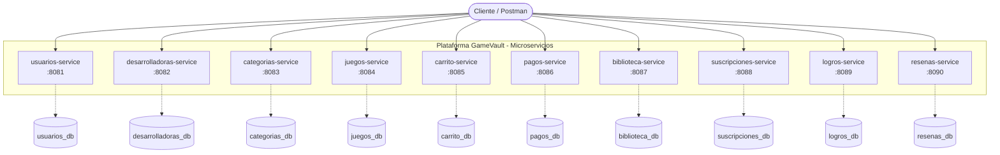
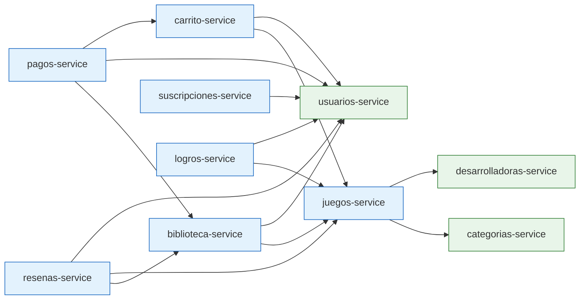
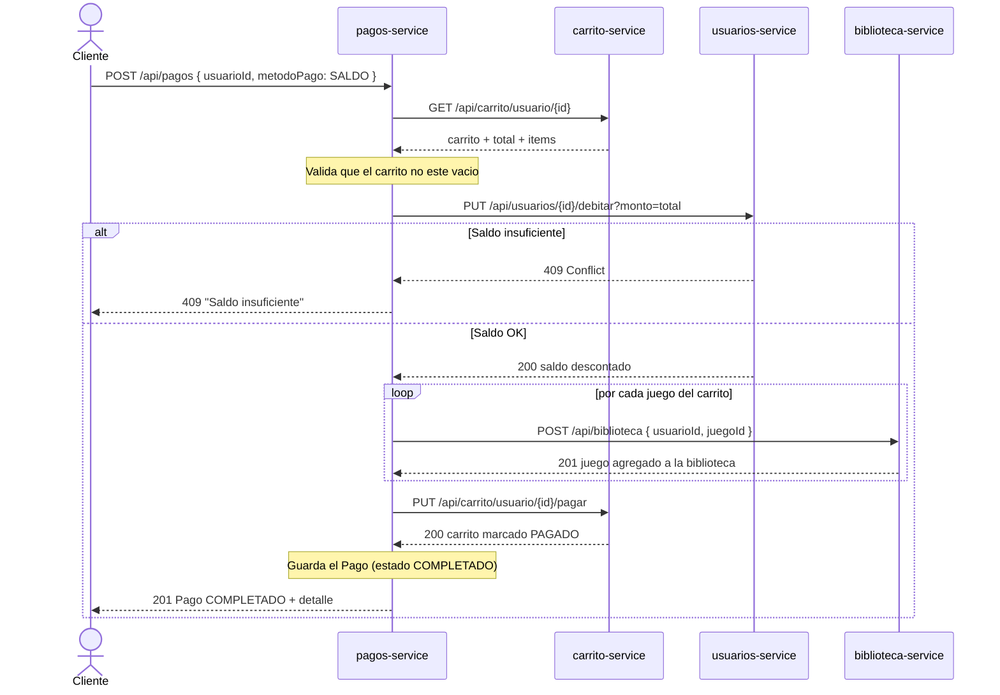

# Diagrama de Arquitectura — GameVault

Documento de apoyo para la **defensa técnica**. Contiene tres diagramas:
1. Arquitectura general de microservicios.
2. Mapa de comunicación (Feign) entre servicios.
3. Diagrama de secuencia del flujo de compra.

> Los diagramas están en **Mermaid**: GitHub los renderiza automáticamente.
> Para proyectarlos también puedes pegarlos en https://mermaid.live

---

## 1. Arquitectura general

Cada microservicio es **independiente**, con su **propia base de datos H2**
(patrón *database per service*) y su propio puerto. El cliente (Postman / front)
consume cada API REST por separado.



---

## 2. Mapa de comunicación entre microservicios (Feign)

Las flechas representan **llamadas REST síncronas** vía OpenFeign. Nótese cómo
`usuarios`, `juegos` y `biblioteca` son los servicios más consumidos.



---

## 3. Flujo de compra (secuencia) — orquestado por `pagos-service`

Es el flujo más importante para demostrar la interoperabilidad: un solo
`POST /api/pagos` coordina **cuatro** microservicios.



---

## 4. Estructura interna de cada microservicio (patrón CSR)

Todos los servicios siguen la misma organización por capas:

```mermaid
flowchart TB
    REQ([HTTP Request]) --> CO

    subgraph Microservicio
        CO[Controller<br/>recibe la peticion REST] --> SE[Service<br/>logica de negocio]
        SE --> RE[Repository<br/>JpaRepository]
        SE -. valida/enriquece .-> FC[Feign Client<br/>llamada remota]
        RE --> MO[(Entidad JPA / BD)]
        DTO[DTOs + Bean Validation]:::aux
        EX[GlobalExceptionHandler<br/>@RestControllerAdvice]:::aux
    end

    CO -. usa .-> DTO
    CO -. errores .-> EX
    RE --> RESP([JSON Response])

    classDef aux fill:#fff3e0,stroke:#e65100;
```
