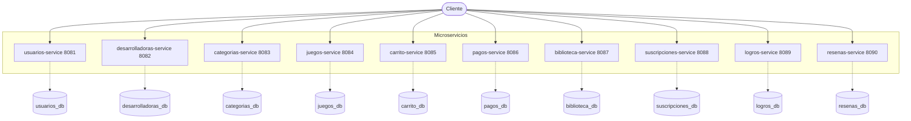
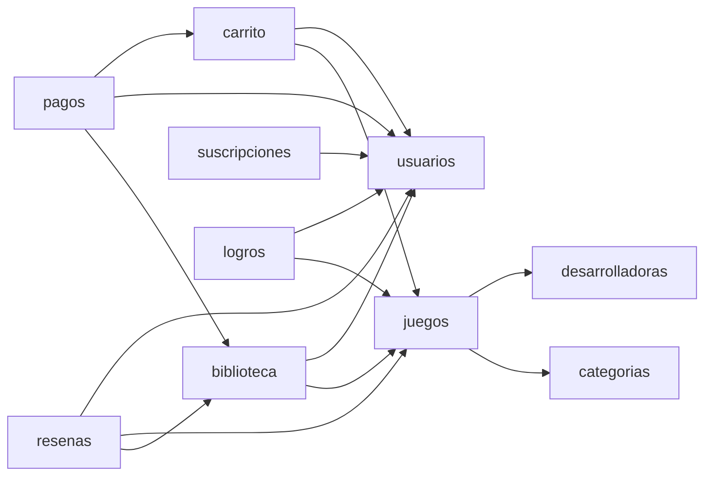
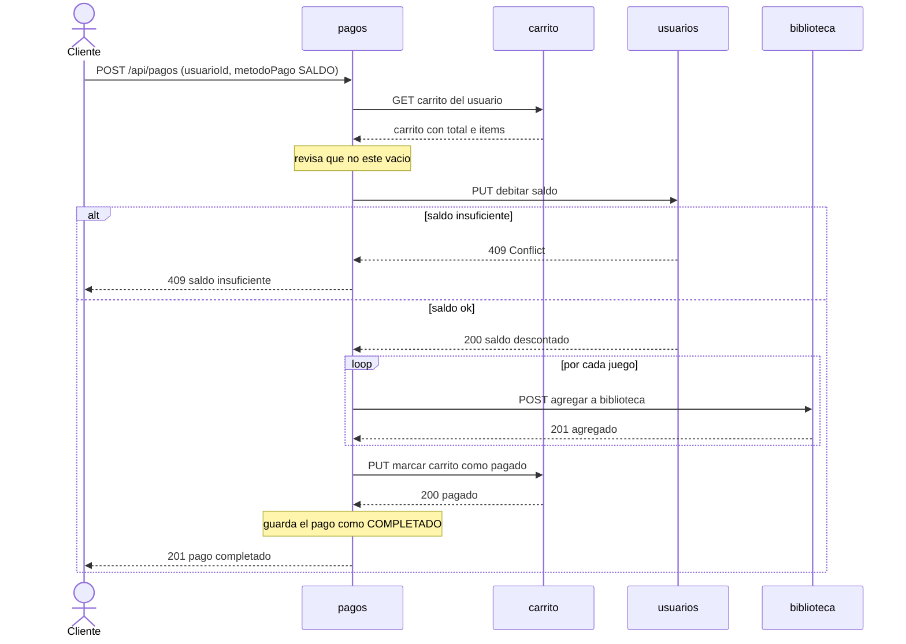
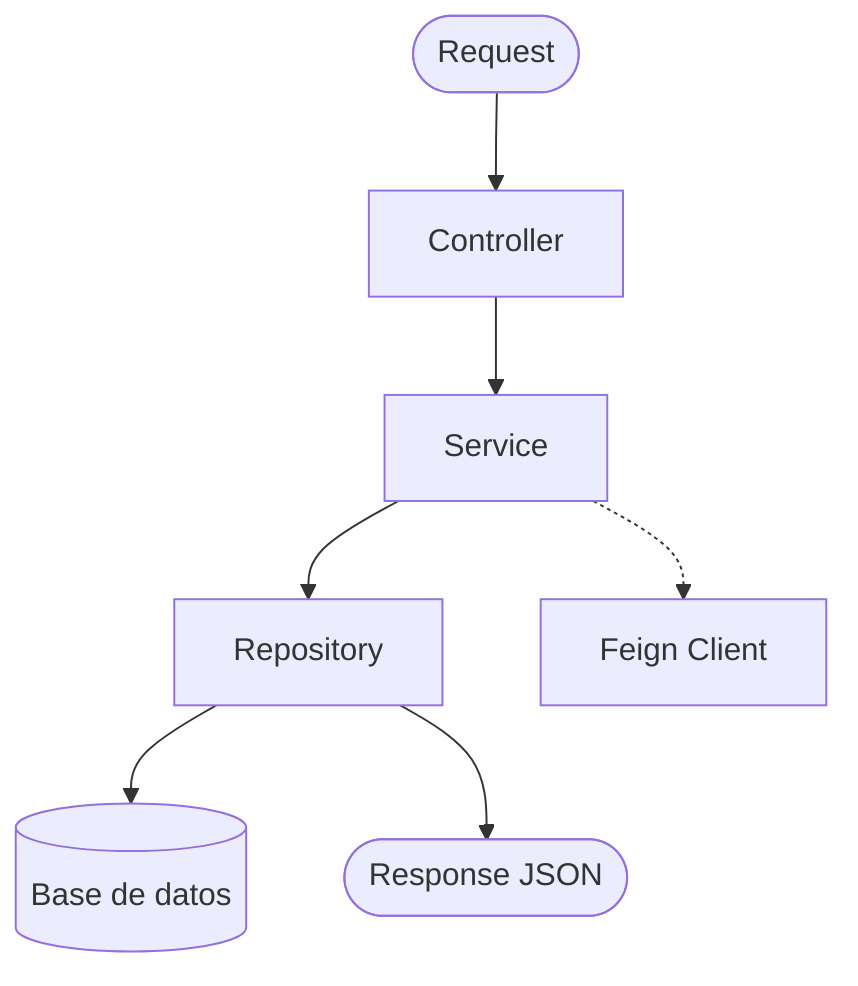

# Diagramas de arquitectura

Documento de apoyo para la defensa. Tiene los diagramas hechos en Mermaid, que
GitHub muestra solo. Tambien se pueden pegar en https://mermaid.live para verlos.

## 1. Arquitectura general

Cada microservicio es independiente, tiene su propia base de datos en MySQL y su
propio puerto. El cliente consume cada API REST por separado.

## 2. Comunicacion entre servicios (Feign)

Las flechas son llamadas REST entre servicios usando OpenFeign.

## 3. Flujo de compra (pagos-service)

Un solo POST /api/pagos coordina cuatro servicios.

## 4. Estructura interna de un microservicio (patron CSR)

Todos los servicios estan organizados igual:

El controller recibe la peticion, el service tiene la logica de negocio, el
repository accede a la base de datos y el Feign Client se usa cuando hay que
pedir datos a otro microservicio. Ademas se usan DTOs para entrar y salir datos,
y un GlobalExceptionHandler para los errores.
